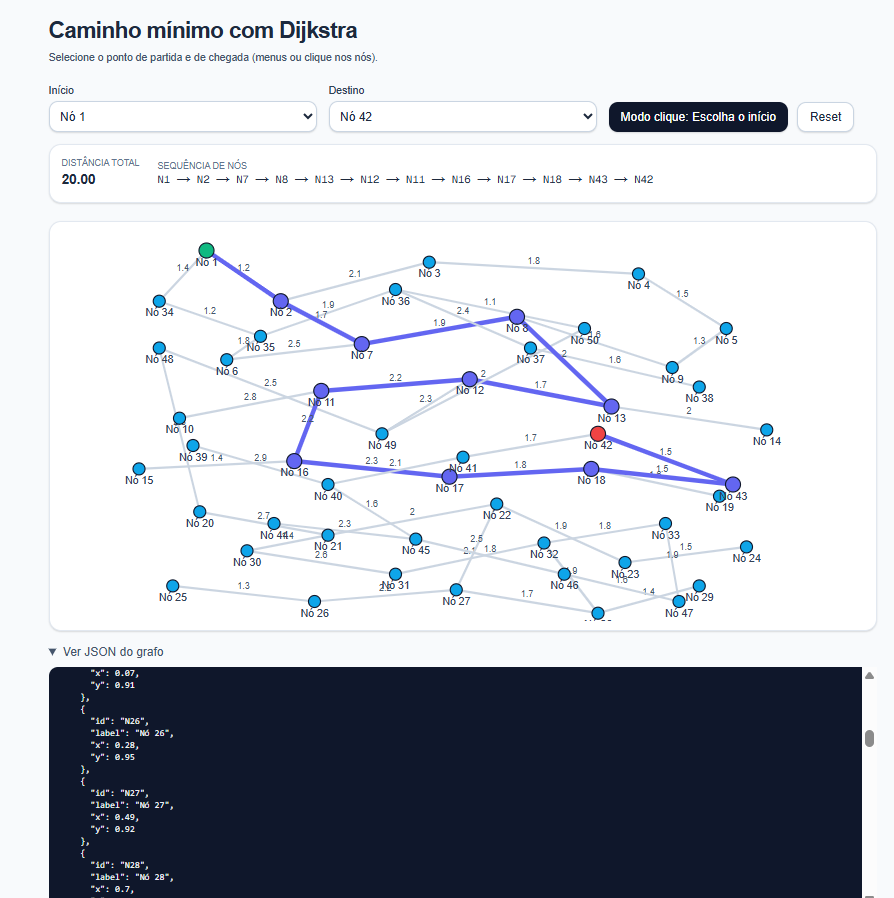
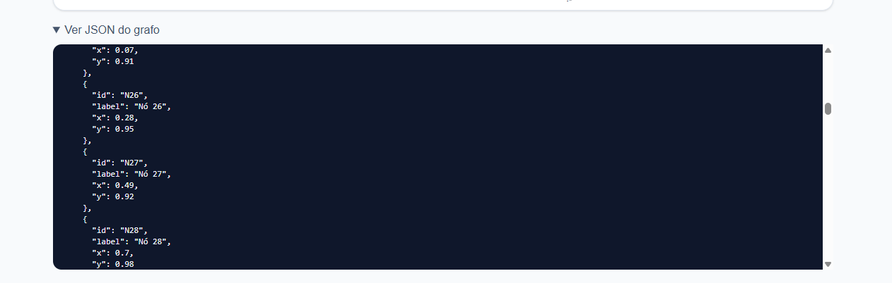

# MenorCaminho

Temas:
- Grafos 2

**Número da Lista**: 34<br>
**Conteúdo da Disciplina**: Dijkstra <br>

## Alunos
|Matrícula | Aluno |
| -- | -- |
| 20/2045769  |  Gabriel Saraiva Canabrava|
| 19/0087188  |  Fillipe Souto de Andrade |

## Sobre 

Este projeto é uma aplicação web interativa que demonstra a implementação do algoritmo de Dijkstra para encontrar o caminho mínimo em grafos, desenvolvida como parte da disciplina de Grafos 1. A aplicação utiliza conceitos fundamentais da teoria dos grafos para resolver problemas de otimização de rotas.

### Objetivo
O projeto tem como objetivo demonstrar a aplicação prática do algoritmo de Dijkstra em um ambiente visual e interativo, fornecendo aos usuários uma ferramenta para encontrar caminhos otimizados entre pontos em um grafo, mostrando como algoritmos de grafos podem ser aplicados em problemas reais de otimização.

### Tecnologias Utilizadas
- **Algoritmo de Dijkstra**: Implementado para encontrar o caminho mínimo em um grafo ponderado
- **Next.js**: Framework React para desenvolvimento web moderno
- **TypeScript**: Linguagem de programação para maior robustez e tipagem
- **Tailwind CSS**: Framework CSS para estilização responsiva

### Funcionalidades
- Visualização interativa de grafos com nós e arestas
- Cálculo automático do caminho mínimo entre dois pontos
- Interface para seleção de origem e destino via dropdown ou clique nos nós
- Exibição da distância total e sequência de nós do caminho ótimo
- Modo de interação alternativo (clique nos nós)
- Visualização em tempo real do algoritmo aplicado

## Screenshots

### Página Principal


### Seleção de Estações


### JSON utilizado


## Instalação 

### Pré-requisitos
- Node.js (versão 18 ou superior)
- npm ou yarn

### Tecnologias
- **Linguagem**: TypeScript
- **Framework**: Next.js

### Passos para instalação

1. Instale as dependências:
```bash
npm install
```

2. Execute o projeto em modo de desenvolvimento:
```bash
npm run dev
```

3. Acesse a aplicação no navegador:
```
http://localhost:3000
```

## Videos

(https://drive.google.com/file/d/10e4c5ZQRMM4DeC45ccESU4zuJ71H-clH/view?usp=sharing)
